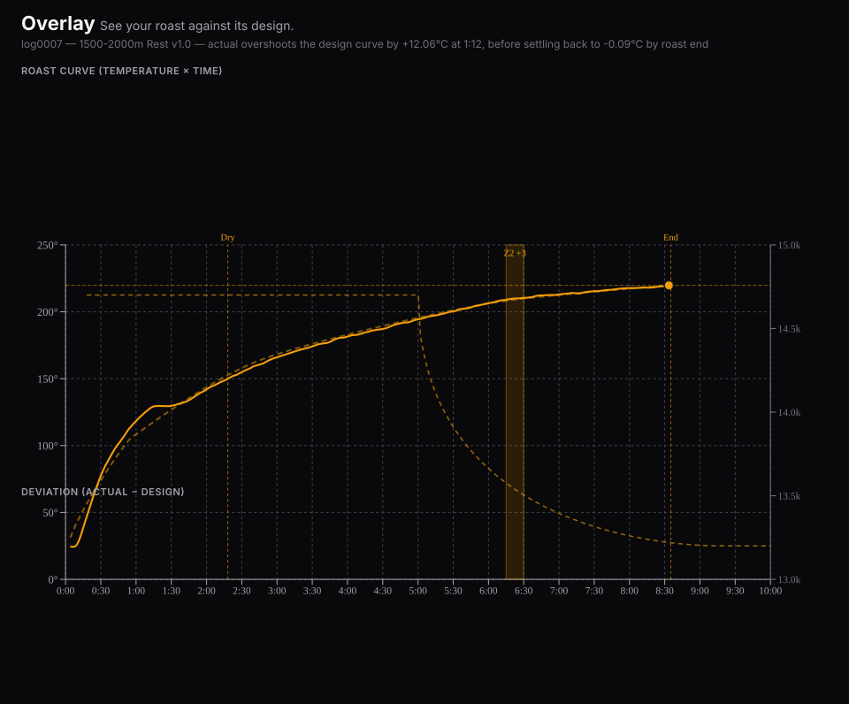

# Overlay

**See your roast against its design.**

Overlay is a browser tool for Kaffelogic roasters. Load two `.kpro` profiles
and it draws them on one chart, with each profile's zones as bands and a
table showing exactly which settings differ. Load a `.klog` and it draws the
roast you actually got against the design curve the machine was following.

**Your files never leave your browser. No account, no upload.** Overlay is a
static site — parsing, charting, and comparison all happen client-side. There
is no server component and nothing is ever sent anywhere.

There are three **Example** buttons on the drop zone if you want to look
around before digging out your own files.

## Why

I roast on a Nano 7 most weekends and change one thing at a time — move a
zone, flip a boost, stretch a phase — then compare the next profile against
the last one.

In Kaffelogic Studio I could not find a way to see the zones of the profile I
was comparing against, and the zone is usually the exact thing I had just
changed. So I built this for myself.

Overlay draws `zone1` / `zone2` / `corner1` as bands for every loaded
profile, and puts preheat, PID, zone times, boosts and recommended level into
one table with the differences marked.

The bundled profile example is two of my own profiles that are identical
except for Zone 2:

| | Zone 2 window | Zone 2 boost |
|---|---|---|
| `Rwanda_Nordic2` | 300–315 s | **+3** |
| `Rwanda_Nordic3` | 300–340 s | **−2** |

Everything else — preheat, PID, Zone 1, Corner 1, recommended level — reads
as identical in the table, so the one change stands out on its own.

## What it does

- **Compare profiles** — load several `.kpro` files and see them on one
  chart, each in its own color, with zones drawn as bands and a scalar diff
  table (preheat, PID, zone start/end, boost, Kp/Kd multipliers, recommended
  level) highlighting what differs from the first-loaded file.
- **Design vs. actual** — load a `.klog` and see the measured curve (solid)
  against the design curve the machine was following (dashed), same color,
  one graph.
- **Align by temperature** — shift each roast's time axis so a chosen
  reference temperature (default column: `mean_temp`) lands at x = 0, instead
  of roast start or the first-crack button press. The design curve shifts
  with it, so the actual-vs-design relationship stays intact. Because first
  crack is a button press rather than a measurement, Maillard / Development /
  DTR are then listed on both bases: in the bundled roast example one of the
  two roasts was pressed about 13.6 s later relative to the same temperature,
  which moves its Development from 1:12.8 to 1:26.4 and its DTR from 13.45 %
  to 15.96 %. The other roast in the pair does not move.
- **Deviation tracking** — a panel under the main chart plots
  `actual − design` over time, with a ±3°C band and a summary: largest
  excursion above and below and when, when it converges, and where it lands
  at roast end.
- **Phases** — Dry end / Maillard / Development / DTR, computed both the
  button way and the temperature way when temperature alignment is active.
- **Level, per file** — each loaded file gets its own Level slider (0–6,
  `roast_levels`-interpolated end temperature), so profiles roasted at
  different levels don't get flattened into one shared value. A "Sync all"
  toggle locks them together when you want that instead.
- **RoR** — actual rate-of-rise, read straight from the log's own
  `actual_ROR` column (not re-derived), with an optional design-RoR overlay.
- **Fan curves** — `fan_profile` on a second axis, dashed.



*The deviation panel on the third bundled example. Running above the design
curve early is normal on many Kaffelogic profiles — the point here is simply
that you can read how far and for how long, instead of estimating it.*

## Usage

```bash
npm install
npm run dev      # http://localhost:5173
npm run build    # static output in dist/ — deploy anywhere (GitHub Pages, Cloudflare Pages, S3, …)
```

Drag `.kpro` and/or `.klog` files onto the drop zone (or click to pick
files). Everything else — parsing, charting, alignment, comparison — happens
in the browser tab.

## A note on privacy

A `.klog` file includes information about the specific roaster that produced
it: a machine serial number (`model:KN1007B/...`), mains voltage,
calibration data, and motor hours. Overlay reads that data only to render
the roast (nothing about it is displayed beyond what feeds the charts) and,
as above, never transmits any file anywhere — so loading your own logs is
safe. If a future version of Overlay ever added a "share this roast" link or
export, that machine-identifying data would need to be stripped first; as of
this version, no such feature exists.

The examples bundled with the app are real roasts and real profiles of mine.
In the published `.klog` copies those same fields — `model`, `mains_voltage`,
`calibration_data`, `motor_hours`, `heater_hours` — have been replaced with
`REDACTED`. Everything that feeds the charts is untouched. `.kpro` files
carry no machine-identifying data at all.

## A note on accuracy: `.kpro` vs. `.klog`

When you load a `.klog`, the design line comes straight from the log's own
`=profile` column — the exact curve the machine itself computed and
followed, not a reconstruction. It's exact.

When you load a bare `.kpro` (a profile with no associated roast), there is
no such recorded column, so Overlay reconstructs the design curve from the
profile's stored control points using cubic Béziers. That reconstruction
matches the machine's own curve closely from about the 60-second mark
onward (average error ≤0.5°C), but is measurably less accurate in the first
minute (average error ~2.3°C, because the machine's own ramp-up logic before
the first anchor point isn't recoverable from the stored data). Comparing
zones and settings between profiles is unaffected by this; if you need
first-minute curve accuracy, load the `.klog` instead of the bare `.kpro`.

## 日本語をお使いの方へ

アプリ右上の **EN / 日本語** トグルで UI 全体を日本語に切り替えられます。
選択は端末に保存され、次回アクセス時も維持されます。仕様の詳細は
[`docs/SPEC.md`](docs/SPEC.md)(日本語)を参照してください。

## License

[MIT](LICENSE)
